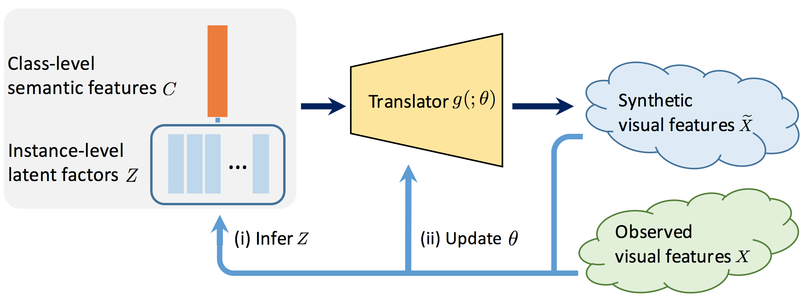

# ZSL_ABP
This is a PyTorch implementation for the conference paper:

Yizhe Zhu, Jianwen Xie , Bingchen Liu, Ahmed Elgammal
["Learning Feature-to-Feature Translator by Alternating Back-Propagation for Zero-Shot Learning", ICCV, 2019](https://arxiv.org/pdf/1904.10056.pdf)

<p align="center">
    
</p>

## Requirements
* Python 3
* pytorch 1.0

## Results evaluated on [GBU setting](https://arxiv.org/abs/1707.00600)

Download the [data](https://www.mpi-inf.mpg.de/departments/computer-vision-and-multimodal-computing/research/zero-shot-learning/zero-shot-learning-the-good-the-bad-and-the-ugly/) and uncompress it to the folder 'data/'.

To train the model, run the following command. 
CUB datset:
```shell
python train_ABP.py --dataset CUB --z_dim 10 --sigma 0.3 --langevin_s 0.1 --langevin_step 5   --batchsize 64 --nSample 300
```
AWA1 datset:
```shell
python train_ABP.py --dataset AWA1 --z_dim 10 --sigma 0.3 --langevin_s 0.1 --langevin_step 5   --batchsize 64 --nSample 1500
```
AWA2 datset:
```shell
python train_ABP.py --dataset AWA2 --z_dim 10 --sigma 0.3 --langevin_s 0.1 --langevin_step 5   --batchsize 64 --nSample 1500
```
SUN datset:
```shell
python train_ABP.py --dataset SUN  --z_dim 10 --sigma 0.3 --langevin_s 0.1 --langevin_step 5   --batchsize 64 --nSample 300 
```

### Citation
If you use this code in your research, please consider citing:
```
@InProceedings{zhu2019learning,
    title={Learning Feature-to-Feature Translator by Alternating Back-Propagation for Generative Zero-Shot Learning},
    author={Zhu, Yizhe and Xie, Jianwen and Liu, Bingchen and Elgammal, Ahmed},
    booktitle = {Proceedings of the IEEE International Conference on Computer Vision (ICCV)},
    month = {Oct},
    year = {2019}
}
```

